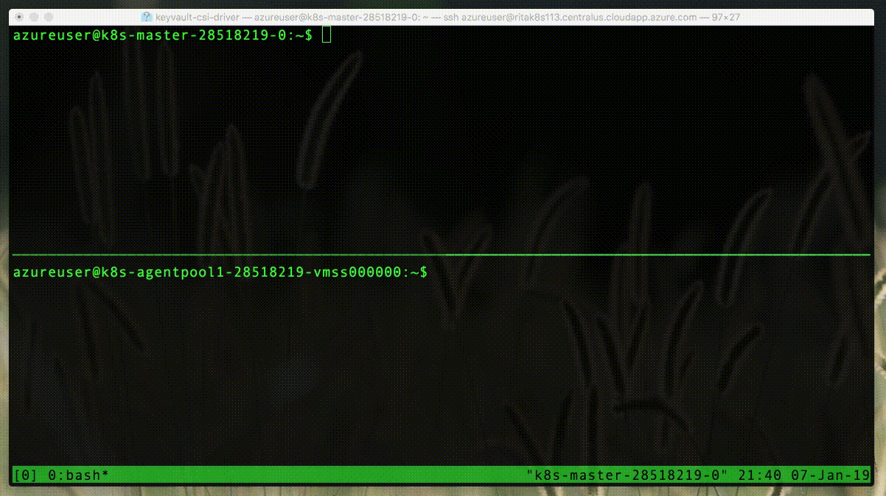

# Kubernetes Secrets Store CSI Driver

Secrets Store CSI Driver for Kubernetes secrets - Integrates secrets stores with Kubernetes via a [Container Storage Interface (CSI)](https://kubernetes-csi.github.io/docs/) volume. The Secrets Store CSI Driver is a subproject of Kubernetes [SIG Auth](https://github.com/kubernetes/community/tree/master/sig-auth).

The Secrets Store CSI Driver `secrets-store.csi.k8s.io` allows Kubernetes to mount multiple secrets, keys, and certs stored in enterprise-grade external secrets stores into their pods as a volume. Once the Volume is attached, the data in it is mounted into the container's file system.

## Test Status

| Test                   | Status                                                                                                                                                                                                                                                                                                                                                                   |
| ---------------------- | ------------------------------------------------------------------------------------------------------------------------------------------------------------------------------------------------------------------------------------------------------------------------------------------------------------------------------------------------------------------------ |
| periodic/image-scan    |                                      |
| periodic/azure-upgrade |              |
| postsubmit/aws         |        |
| postsubmit/azure       |  |
| postsubmit/gcp         |        |
| postsubmit/vault       |  |

## Want to help?

Join us to help define the direction and implementation of this project!

- Join the [#csi-secrets-store](https://kubernetes.slack.com/messages/csi-secrets-store) channel on [Kubernetes Slack](https://kubernetes.slack.com/).
- Join the [Mailing list](https://groups.google.com/forum/#!forum/kubernetes-secrets-store-csi-driver) to receive notifications for releases, security announcements, etc.
- Use [GitHub Issues](https://github.com/kubernetes-sigs/secrets-store-csi-driver/issues) to file bugs, request features, or ask questions asynchronously.
- Join [biweekly community meetings](https://docs.google.com/document/d/1q74nboAg0GSPcom3kLWCIoWg43Qg3mr306KNL58f2hg/edit?usp=sharing) to discuss development, issues, use cases, etc.

## Features

- Mounts secrets/keys/certs to pod using a CSI Inline volume
- Supports mounting multiple secrets store objects as a single volume
- Supports multiple secrets stores as providers. Multiple providers can run in the same cluster simultaneously.
- Supports pod portability with the SecretProviderClass CRD
- Supports Linux and Windows containers
- Supports sync with Kubernetes Secrets

## Demo

## Getting Started

Check out the [installation instructions](https://secrets-store-csi-driver.sigs.k8s.io/getting-started/installation.html) to deploy the Secrets Store CSI Driver and providers. Get familiar with our [CRDs and core components](https://secrets-store-csi-driver.sigs.k8s.io/concepts.html)

## Development Guide

Follow these [steps](./.local/README.md) to setup Secrets Store CSI Driver for local debugging.

## Documentation

Please see the [docs](https://secrets-store-csi-driver.sigs.k8s.io) for more in-depth information and supported features.

## Getting involved and contributing

Are you interested in contributing to secrets-store-csi-driver? We, the maintainers and community, would love your suggestions, contributions, and help! Also, the maintainers can be contacted at any time to learn more about how to get involved.

In the interest of getting more new people involved, we tag issues with [`good first issue`](https://github.com/kubernetes-sigs/secrets-store-csi-driver/issues?q=is%3Aissue+is%3Aopen+sort%3Aupdated-desc+label%3A%22good+first+issue%22). These are typically issues that have smaller scope but are good ways to start to get acquainted with the codebase.

We also encourage ALL active community participants to act as if they are maintainers, even if you don't have "official" write permissions. This is a community effort, we are here to serve the Kubernetes community. If you have an active interest and you want to get involved, you have real power! Don't assume that the only people who can get things done around here are the "maintainers".

We also would love to add more "official" maintainers, so show us what you can do!

> Check out [Secrets Store CSI Driver Membership](./docs/MEMBERSHIP.md) for more information.

## Code of conduct

Participation in the Kubernetes community is governed by the [Kubernetes Code of Conduct](code-of-conduct.md).
