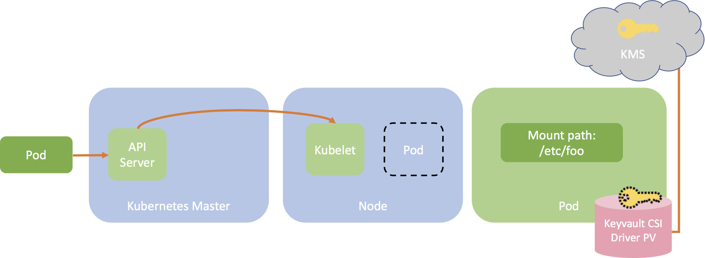

# Kubernetes-KeyVault-CSI-Driver

Key Vault CSI driver for Kubernetes secrets - Integrates Key Management Systems with Kubernetes via a CSI volume.  

The Key Vault CSI driver `keyvault.csi.k8s.com` allows Kubernetes to mount multiple secrets, keys, and certs stored in Key Management Systems into their pods as a volume. Once the Volume is attached, the data in it is mounted into the container's file system. 

## Features

- Mounts secrets/keys/certs to pod using a CSI volume
- Supports mounting multiple key vault objects as a single volume
- Supports pod identity to restrict access with specific identities (WIP)
- Supports multiple Key Management Systems as providers

#### Table of Contents

* [How It Works](#how-it-works)
* [Usage](#usage)
* [Providers](#providers)
    + [Azure Key Vault Provider](#azure-key-vault-provider)
    + [Adding a New Provider via the Provider Interface](#adding-a-new-provider-via-the-provider-interface)
* [Testing](#testing)
    + [Unit Tests](#unit-tests)
    + [End-to-end Tests](#end-to-end-tests)
* [Known Issues and Workarounds](#known-issues-and-workarounds)
* [Contributing](#contributing)

## How It Works

The diagram below illustrates how Keyvault CSI Volume works.



## Usage ##

Deploy a Kubernetes cluster and make sure it's reachable.

### Install the Key Vault CSI Driver ###

```bash
kubectl apply -f deploy/crd-csi-driver-registry.yaml
kubectl apply -f deploy/rbac-csi-driver-registrar.yaml
kubectl apply -f deploy/rbac-csi-attacher.yaml
kubectl apply -f deploy/csi-keyvault-attacher.yaml
kubectl apply -f deploy/keyvault-csi-driver.yaml
```
To validate the installer is running as expected, run the following commands:

```bash
kubectl get po
```

You should see the keyvault CSI driver pods running on each agent node:

```bash
csi-keyvault-2c5ln         2/2     Running   0          4m
csi-keyvault-attacher-0    1/1     Running   0          6m
csi-keyvault-qp9r8         2/2     Running   0          4m
csi-keyvault-zrjt2         2/2     Running   0          4m
```
### Use the Key Vault CSI Driver ###

1. Select a provider from the [list of supported providers](#providers)

2. To create a Keyvault CSI volume, follow [specific deployment steps](#providers) for the selected provider to update all the required fields in [this deployment yaml](deploy/example/pv-keyvault-csi.yaml).

```yaml
csi:
  driver: keyvault.csi.k8s.com
  readOnly: true
  volumeHandle: kv
  volumeAttributes:
    providerName: "azure"
    ...
```
3. Deploy your PersistentVolume (CSI Volume)

```bash
kubectl apply -f deploy/example/pv-keyvault-csi.yaml
```

4. Deploy a static pvc pointing to your persistentvolume

```bash
kubectl apply -f deploy/example/pvc-keyvault-csi-static.yaml
```

5. Fill in the missing pieces in [this pod deployment yaml](deploy/example/nginx-pod-keyvault.yaml) to create your own pod pointing to your PVC. 
Make sure to specify the mount point.

```yaml
volumeMounts:
  - name: keyvault01
    mountPath: "/mnt/keyvault"
```

Example of an nginx pod accessing a secret from a PV created by the Key Vault CSI Driver:

```yaml
kind: Pod
apiVersion: v1
metadata:
  name: nginx-keyvault
spec:
  containers:
  - image: nginx
    name: nginx-keyvault
    volumeMounts:
    - name: keyvault01
      mountPath: "/mnt/keyvault"
  volumes:
  - name: keyvault01
    persistentVolumeClaim:
      claimName: pvc-keyvault
```

Deploy your app

```bash
kubectl apply -f deploy/example/nginx-pod-keyvault.yaml
```

Validate the pod has access to the secret from your key vault instance:

```bash
kubectl exec -it nginx-flex-kv cat /mnt/keyvault/testsecret
testvalue
```

## Providers

This project features a pluggable provider interface developers can implement that defines the actions of the Keyvault CSI driver.

This enables on-demand retrieval of secret objects storied a Key Management System into Kubernetes while continue to manage these objects outside of Kubernetes.

Each provider may have its own required properties.

Providers must provide the following functionality to be considered a supported integration.
1. Provides the backend plumbing necessary to access objects from the Key Management System.
2. Conforms to the current API provided by Keyvault CSI Driver.
3. Does not have access to the Kubernetes APIs and has a well-defined callback mechanism to mount objects to a target path.

### Azure Key Vault Provider

The KeyVault CSI driver Azure Key Vault Provider offers two modes for accessing a Key Vault instance: Service Principal and Pod Identity.

#### OPTION 1 - Service Principal

Add your service principal credentials as a Kubernetes secrets accessible by the KeyVault CSI driver.

```bash
kubectl create secret generic keyvault-creds --from-literal clientid=<CLIENTID> --from-literal clientsecret=<CLIENTSECRET>
```

Ensure this service principal has all the required permissions to access content in your key vault instance. 
If not, you can run the following using the Azure cli:

```bash
# Assign Reader Role to the service principal for your keyvault
az role assignment create --role Reader --assignee <principalid> --scope /subscriptions/<subscriptionid>/resourcegroups/<resourcegroup>/providers/Microsoft.KeyVault/vaults/<keyvaultname>

az keyvault set-policy -n $KV_NAME --key-permissions get --spn <YOUR SPN CLIENT ID>
az keyvault set-policy -n $KV_NAME --secret-permissions get --spn <YOUR SPN CLIENT ID>
az keyvault set-policy -n $KV_NAME --certificate-permissions get --spn <YOUR SPN CLIENT ID>
```

Fill in the missing pieces in [this](deploy/example/pv-keyvault-csi) deployment to create your own pv, make sure to:

1. reference the service principal kubernetes secret created in the previous step
```yaml
nodePublishSecretRef:
  name: keyvault-creds
```
2. pass in properties for the Key Vault instance to the CSI driver to create a PV

|Name|Required|Description|Default Value|
|---|---|---|---|
|providerName|yes|specify name of the provider|""|
|usePodIdentity|no|specify access mode: service principal or pod identity|"false"|
|keyvaultName|yes|name of a Key Vault instance|""|
|objects|yes|a string of arrays of strings|""|
|objectName|yes|name of a Key Vault object|""|
|objectType|yes|type of a Key Vault object: secret, key or cert|""|
|objectVersion|no|version of a Key Vault object, if not provided, will use latest|""|
|resourceGroup|yes|name of resource group containing key vault instance|""|
|subscriptionId|yes|subscription ID containing key vault instance|""|
|tenantId|yes|tenant ID containing key vault instance|""|

```yaml
  csi:
    driver: keyvault.csi.k8s.com
    readOnly: true
    volumeHandle: kv
    volumeAttributes:
      providerName: "azure"
      usePodIdentity: "false"         # [OPTIONAL] default to "false" if empty
      keyvaultName: ""                # name of the KeyVault
      objects:  |
        array:                        # array of objects
          - |
            objectName: secret1
            objectType: secret        # object types: secret, key or cert
            objectVersion: ""         # [OPTIONAL] object versions, default to latest if empty
          - |
            objectName: key1
            objectType: key
            objectVersion: ""
      resourceGroup: ""               # resource group of the KeyVault
      subscriptionId: ""              # subscription ID of the KeyVault
      tenantId: ""                    # tenant ID of the KeyVault
      ...
```

#### OPTION 2 - Pod Identity

_WIP_

### Adding a New Provider via the Provider Interface

Create a new directory for your provider under `providers` and implement the following interface. 
Then add your provider in `providers/register/provider_<provider_name>.go`. Make sure to add a build tag so that
your provider can be excluded from being built. The format for this build tag
should be `no_<provider_name>_provider`. 

```go
// Provider contains the methods required to implement a Keyvault CSI Driver provider.
type Provider interface {
    // MountKeyVaultObjectContent mounts content of the keyvault object to target path
    MountKeyVaultObjectContent(ctx context.Context, attrib map[string]string, secrets map[string]string, targetPath string, permission os.FileMode) error
}
```

## Testing

### Unit Tests

Run unit tests locally with `make test`.

### End-to-end Tests

_WIP_

## Known Issues and Workarounds

_WIP_

## Contributing
