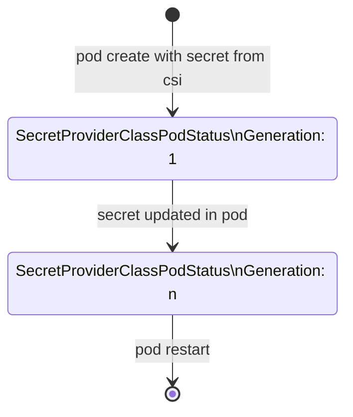

# Auto restart of pods when secret is rotated

> NOTE: This is a suggested implementation that can be used alongside the Secrets Store CSI Driver. This solution is neither supported nor tested by the Secrets Store CSI Driver project.

When [auto rotation of secrets](./secret-auto-rotation.md) is enabled, workloads that depend on secrets will need to either:
- watch for updates to the secrets and reload these in their runtime, or
- be restarted to pick up the latest secrets when they change

A solution like [Reloader](https://github.com/stakater/Reloader) can watch updates to Kubernetes Secrets or ConfigMaps and restart pods when a change is detected. However, if secret values are mounted as volumes in the pods, that solution is not suitable.

Using custom resources created by the Secrets Store CSI Driver, a Kubernetes controller can detect when secrets are updated by the driver and restart the associated pods.

## SecretProviderClassPodStatus custom resource

The relevant custom resource is [`SecretProviderClassPodStatus`](./concepts#secretproviderclasspodstatus).

Each `SecretProviderClassPodStatus` custom resource (CR) has a one-to-one relationship with a pod that references secrets using the Secrets Store CSI Driver. The CR includes the pod name, namespace and other attributes. The driver manages the lifecycle of `SecretProviderClassPodStatus` which is tied to the lifecycle of the associated pod.



When the driver sets a secret value for a new pod, a `SecretProviderClassPodStatus` CR is created with the `Generation` attribute set to `1`. 

Whenever the driver updates the secret value, the value of the `Generation` attribute is incremented.

If a pod is restarted, the CR is deleted and a new CR created with `Generation: 1`.

`SecretProviderClassPodStatus` CRs persist across lifetimes of the secrets-store-csi-driver.

## Outline of Controller function

1. Reconcile

    The controller reconciles instances of the `SecretProviderClassPodStatus` CR and deletes (to restart) the associated pod if required.

    If a `SecretProviderClassPodStatus` has `Generation: 1`, it is linked to a newly created pod. The pod should not be restarted.

    If a `SecretProviderClassPodStatus` has `Generation` > 1, it is linked to a pod in which the secrets-store-csi-driver has updated a secret. The pod should be restarted (if it has opted-in for automatic restarting).

1. Rolling restart

    On reconciling a pod which should be updated, check `metadata.ownerReferences` and walk up to a Deployment (or similar) if present.

    If a `Deployment` is found:

    - Do not restart pod
    - Update the Deployment to trigger a rolling restart
    - If the number of replicas > 1, update the Deployment once only

    To restart a deployment, the controller sets a timestamped annotation in the deployment

    ```
      template:
        metadata:
          annotations:
            my.controller/restartedAt: "2024-09-05T14:06:29Z"
    ```

    Else: delete pod.

1. Opt-in to automatic pod restarting

    Automatic restarting of pods when secrets are updated could be an opt-in behaviour. Unless the pod declares its opt-in, it should not be restarted by the controller.

    The opt-in could be indicated via an optional annotation set on the pod:
    ```
      kind: pod
      metadata:
        annotations:
          my.controller/restartOnChange: true
    ```

## Implementation notes

The [operator-sdk](https://github.com/operator-framework/operator-sdk) can be used to scaffold an implementation project.

1. Scaffolding the project

    ```
    operator-sdk init --repo=<your repo>
    operator-sdk create api --version v1alpha1 --kind SecretProviderClassPodStatus --resource=false --controller=true
    ```

1. Custom resources

    The controller does not manage custom resources of its own. It simply watches a custom resource provided by the Secrets Store CSI Driver.

1. Permissions required

    The controller requires RBAC permissions to operate on various k8s resources.

    To watch `SecretProviderClassPodStatus`
    ```
    // +kubebuilder:rbac:groups=secrets-store.csi.x-k8s.io,resources=secretproviderclasspodstatuses,verbs=get;list;watch
    ```

    To lookup and if necessary delete `Pod`
    ```
    // +kubebuilder:rbac:groups="",resources=pods,verbs=get;list;watch;delete
    ```

    To lookup possible owner of `Pod`
    ```
    // +kubebuilder:rbac:groups="apps",resources=daemonsets,verbs=get;list;watch
    // +kubebuilder:rbac:groups="apps",resources=replicasets,verbs=get;list;watch
    // +kubebuilder:rbac:groups="apps",resources=statefulsets,verbs=get;list;watch
    // +kubebuilder:rbac:groups="apps",resources=deployments,verbs=get;list;watch
    ```

    To lookup and if necessary trigger update of `Deployment`
    ```
    // +kubebuilder:rbac:groups="apps",resources=deployments,verbs=get;list;watch;update
    ```
