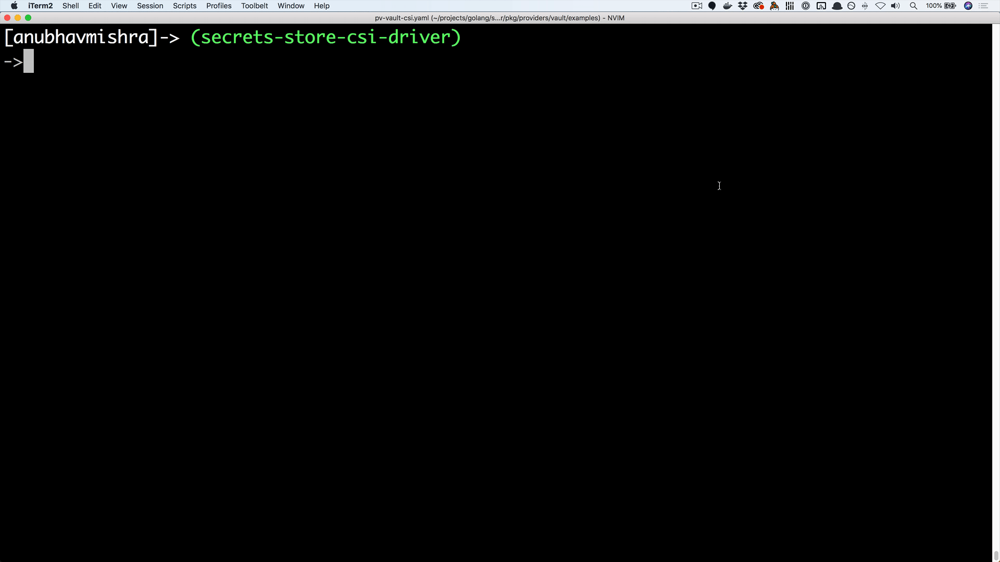

# HashiCorp Vault Provider for Secret Store CSI Driver

HashiCorp [Vault](https://vaultproject.io) provider for Secret Store CSI driver allows you to get secrets stored in
Vault and use the Secret Store CSI driver interface to mount them into Kubernetes pods.

**This is an experimental project. This project isn't production ready.**

## Demo



## Prerequisites

The guide assumes the following:

* A Kubernetes cluster up and running.
* A Vault cluster up and running. Instructions for spinning up a *development* Vault cluster in Kubernetes can be
found [here](./docs/vault-setup.md).
* [kubectl](https://kubernetes.io/docs/tasks/tools/install-kubectl/#install-kubectl) installed.

## Usage

This guide will walk you through the steps to configure and run the Vault provider for Secret Store CSI
driver on Kubernetes.

Make sure you have followed the [prerequisites](#prerequisites) specified above before you continue with this guide.
You should have a development Vault cluster up and running using the [guide](./docs/vault-setup.md) specified above.


### Install the Secrets Store CSI Driver (Kubernetes Version 1.15.x+)

Make sure you have followed the [Installation guide for the Secrets Store CSI Driver](https://github.com/deislabs/secrets-store-csi-driver#usage)

### Create a SecretProviderClass Resource and a Deployment

Update [this sample deployment](examples/v1alpha1_secretproviderclass.yaml) to create a `secretproviderclasses` resource to provide Vault-specific parameters for the Secrets Store CSI driver.

```yaml
apiVersion: secrets-store.csi.k8s.com/v1alpha1
kind: SecretProviderClass
metadata:
  name: vault-foo
spec:
  provider: vault
  parameters:
    roleName: "example-role"                    # Vault role created in prerequisite steps
    vaultAddress: "http://10.0.38.189:8200"     # Kubernetes Vault service endpoint
    vaultSkipTLSVerify: "true"
    objects:  |
      array:
        - |
          objectPath: "/foo"                    # secret path in the Vault Key-Value store e.g. vault kv put secret/foo bar=hello
          objectName: "bar"
          objectVersion: ""
```

> NOTE: Make sure the `vaultAddress` is pointing to the Kubernetes `vault` service that is created in the prerequisite steps.
You can get the `vault` service address using the following command.

```bash
kubectl get service vault
```

We will use an NGINX deployment to showcase accessing the secret mounted by the Secret Store CSI Driver.
The mount point and the `secretProviderClass` configuration for the secret will be in the [pod deployment specification](./examples/nginx-pod-vault-inline-volume-secretproviderclass.yaml) file.

```yaml
kind: Pod
apiVersion: v1
metadata:
  name: nginx-secrets-store-inline
spec:
  containers:
  - image: nginx
    name: nginx
    volumeMounts:
    - name: secrets-store-inline
      mountPath: "/mnt/secrets-store"
      readOnly: true
  volumes:
    - name: secrets-store-inline
      csi:
        driver: secrets-store.csi.k8s.com
        readOnly: true
        volumeAttributes:
          secretProviderClass: "vault-foo"
```

Deploy the application

```bash
kubectl apply -f examples/nginx-pod-vault-inline-volume-secretproviderclass.yaml
```

Validate Secret in Pod

```bash
kubectl exec -it nginx-secrets-store-inline cat /mnt/secrets-store/foo
hello
```
